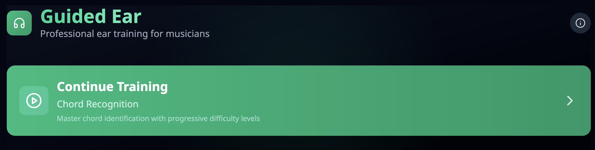
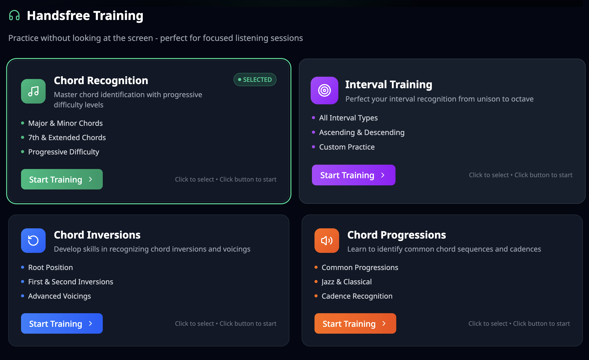
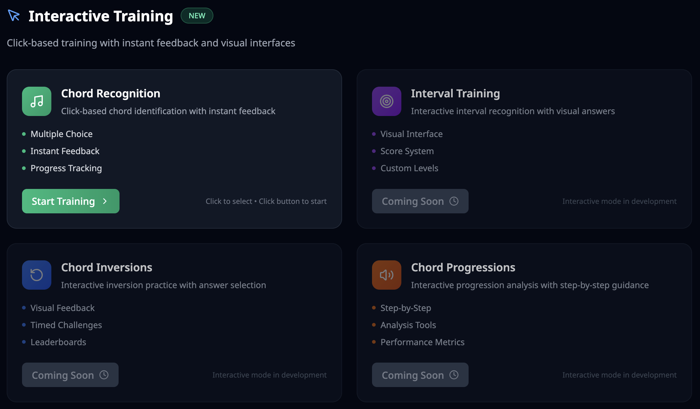
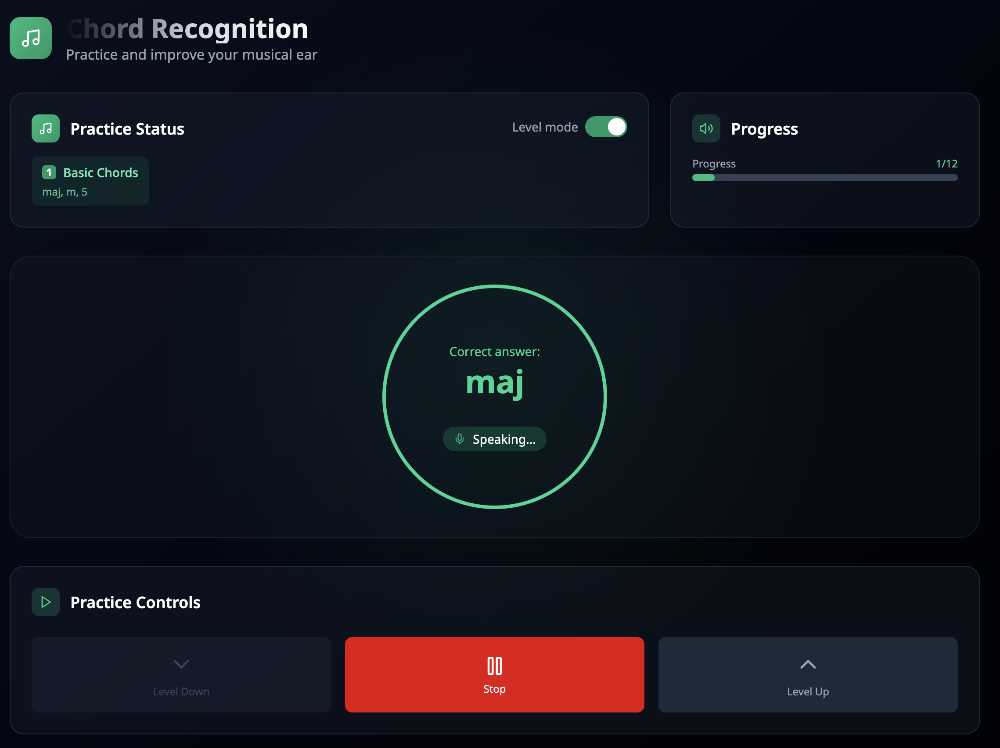
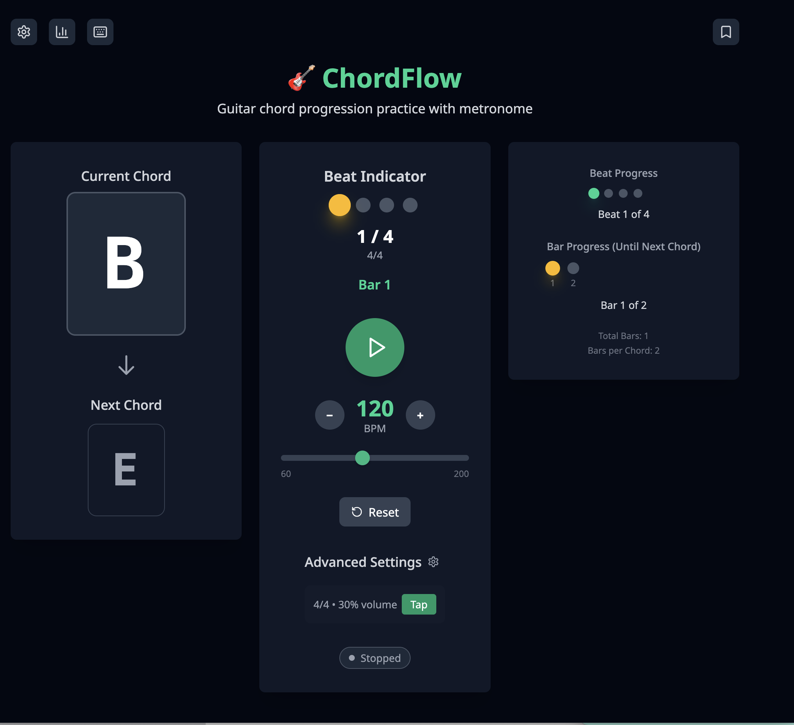
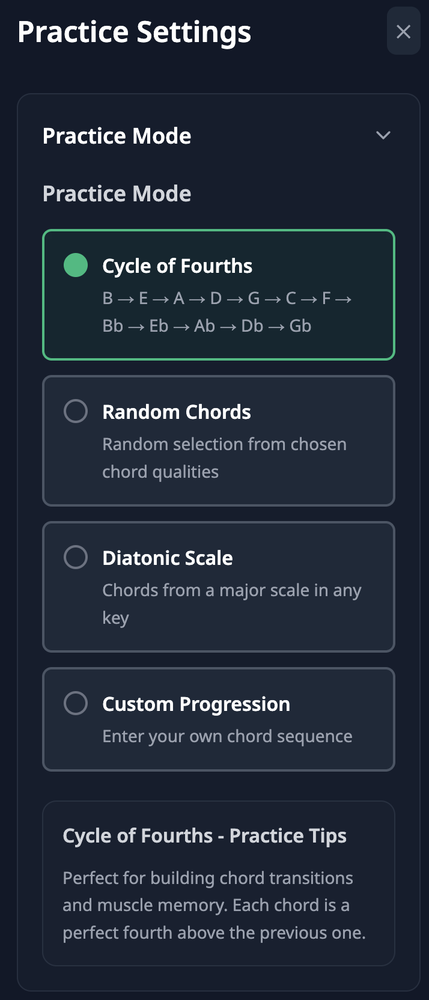
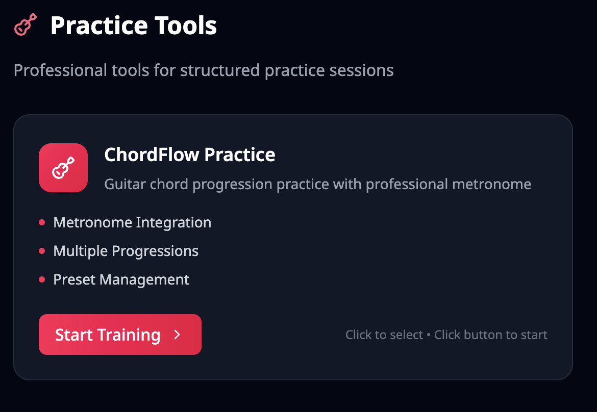

# 🎵 Guided Ear Training

> **Practice and improve your musical ear with interactive training modules**

A modern, comprehensive ear training application built with Svelte 5 that helps musicians develop their listening skills through progressive practice sessions. Features both hands-free voice training
and interactive click-based practice modes.

## 🌐 Live Demo

**[🚀 Try Guided Ear Training Now](https://guided-ear.vercel.app/)**

Experience the full application live on Vercel - no installation required!



## ✨ Features

### 🎼 Dual Training Paradigms

#### **Handsfree Training** 🎤

- **Voice-Guided Practice** - Listen and learn without manual interaction
- **Speech Synthesis** - Automatic answers and feedback
- **Continuous Practice** - Uninterrupted flow for immersive sessions
- **Progressive Learning** - Automatic level advancement and recap modes



#### **Interactive Training** 🖱️ _NEW_

- **Click-Based Answers** - Multiple choice with visual feedback
- **Comprehensive Options** - See all available chord types, no elimination
- **Real-Time Statistics** - Track accuracy, response time, and streaks
- **Performance Metrics** - Detailed progress tracking and analytics



### 🎯 Core Training Modules

- **Chord Recognition** - Master identification of major, minor, diminished, augmented, and extended chords with standard music notation (maj, m, 7, m7♭5, etc.)
- **Interval Training** - Practice recognizing musical intervals from unison to octave
- **Chord Inversions** - Learn to identify root position, first, and second inversions
- **Chord Progressions** - Develop skills in recognizing chord sequences and harmonic movement

|                      Handsfree Chord Recognition                       |                        Interactive Chord Recognition                         |
| :--------------------------------------------------------------------: | :--------------------------------------------------------------------------: |
|  |  |

### 🎹 ChordFlow Practice System

- **Multiple Progression Types**:
  - Cycle of Fourths (classic jazz progression pattern)
  - Random Chords (practice with selected chord qualities)
  - Diatonic Progressions (scale-based sequences with incremental or random selection)
  - Custom Progressions (user-defined sequences with flexible formatting)
- **Enhanced Metronome** - Precise audio/visual synchronization with configurable tempo and time signature
- **Chord Audio Playback** - Optional sounds with multiple voicing options (close, open, shell)
- **Preset Library** - Common progressions organized by category (Popular, Jazz, Blues, etc.)
- **Settings Persistence** - All preferences automatically saved



#### ChordFlow Mode Selection



### 🧠 Intelligent Training System

- **Progressive Difficulty** - Incremental learning with customizable levels
- **Multiple Play Modes** - Custom selection, incremental progression, and recap modes
- **Audio Feedback** - High-quality SoundFont-based playback with speech synthesis
- **Comprehensive Statistics** - Track practice time, accuracy, streaks, and session history
- **Automatic Settings Sync** - All preferences and progress saved locally
- **Responsive Design** - Optimized for desktop and mobile practice sessions



### 💾 Data Persistence & Analytics

- **Automatic Saving** - All settings and statistics persist across browser sessions
- **Interactive Stats** - Accuracy rates, response times, best streaks, and answer history
- **Handsfree Analytics** - Session duration, exercise counts, and practice history
- **Settings Backup** - Export/import functionality for data portability
- **Development Tools** - Storage debugger for advanced users

## 🚀 Getting Started

### Prerequisites

- Node.js 18+
- pnpm (recommended) or npm

### Installation

```bash
# Clone the repository
git clone https://github.com/timvancann/guided-ear.git
cd guided-ear

# Install dependencies
pnpm install

# Start development server
pnpm dev
```

Visit `http://localhost:5173` to start training!

## 🛠️ Development

### Available Scripts

```bash
# Development
pnpm dev                 # Start development server
pnpm dev -- --open       # Start dev server and open browser

# Building
pnpm build              # Build for production
pnpm preview            # Preview production build

# Code Quality
pnpm check              # Run Svelte type checking
pnpm check:watch        # Run type checking in watch mode
pnpm lint               # Run ESLint and Prettier checks
pnpm format             # Format code with Prettier
```

### CI/CD Pipeline

This project uses GitHub Actions for continuous integration. The pipeline automatically runs on:

- Every push to the `main` branch
- Every pull request targeting the `main` branch

The CI pipeline performs the following checks:

- **Linting**: Runs ESLint and Prettier checks (`pnpm lint`)
- **Type Checking**: Validates TypeScript types (`pnpm check`)
- **Building**: Ensures the project builds successfully (`pnpm build`)
- **Testing**: Runs tests if available (`pnpm test`)

#### Setting up Branch Protection

To ensure code quality, configure branch protection rules for the `main` branch:

1. Go to Settings → Branches in your GitHub repository
2. Add a branch protection rule for `main`
3. Enable the following:
   - ✅ Require a pull request before merging
   - ✅ Require status checks to pass before merging
   - ✅ Require branches to be up to date before merging
   - Select these required status checks:
     - `test (20.x)`
     - `test (22.x)`
   - ✅ Require conversation resolution before merging
   - ✅ Do not allow bypassing the above settings

This ensures all code changes are properly reviewed and pass CI checks before being merged.

### Pre-commit Hooks

For local development, we use [pre-commit](https://pre-commit.com/) to run the same checks before every commit:

#### Setup

```bash
# Install pre-commit (if not already installed)
pip install pre-commit
# or
brew install pre-commit

# Install the git hook scripts
pnpm pre-commit:install

# (Optional) Run against all files
pnpm pre-commit:run
```

#### What it checks

The pre-commit hooks will automatically:

- ✅ Fix trailing whitespace and end-of-file issues
- ✅ Validate YAML and JSON files
- ✅ Check for merge conflicts and large files
- ✅ Detect private keys
- ✅ Run Prettier formatting
- ✅ Run ESLint with auto-fix (warnings only for existing issues)
- ✅ Run a full build check (on git push only)

Note: TypeScript type checking is available via `pnpm check` but temporarily disabled in pre-commit hooks due to type declaration conflicts with prettier.

If any check fails, the commit will be aborted and you'll need to fix the issues before committing.

### Tech Stack

- **Framework**: [Svelte 5](https://svelte.dev/) with SvelteKit and modern runes system
- **Language**: TypeScript with full type safety
- **Styling**: [Tailwind CSS 4.0](https://tailwindcss.com/)
- **Audio**: [WebAudioFont](https://surikov.github.io/webaudiofont/) via [smplr](https://github.com/danigb/smplr)
- **Music Theory**: [Tonal.js](https://github.com/tonaljs/tonal)
- **Icons**: [Lucide](https://lucide.dev/)
- **Build Tool**: [Vite](https://vitejs.dev/)
- **Storage**: localStorage with automatic sync

## 🎯 Architecture

### Core Components

```
src/
├── lib/
│   ├── training/           # Dual training system
│   │   ├── types.ts        # Core interfaces
│   │   ├── TrainingEngine.svelte.ts         # Handsfree engine
│   │   ├── InteractiveTrainingEngine.svelte.ts  # Interactive engine
│   │   └── modes/          # Specific implementations
│   ├── chordflow/          # ChordFlow practice system
│   │   ├── state.svelte.ts        # Reactive state management
│   │   ├── chordGenerator.svelte.ts # Progression logic
│   │   ├── metronome.svelte.ts     # Enhanced metronome
│   │   └── chordAudio.svelte.ts    # Chord playback system
│   ├── components/         # UI components
│   │   ├── training/       # Generic training UI
│   │   ├── chordflow/      # ChordFlow specific UI
│   │   └── settings/       # Settings and configuration
│   ├── storage.svelte.ts   # localStorage utilities
│   └── audioplayer.svelte.ts  # Global audio system
└── routes/                 # SvelteKit pages
    ├── handsfree/         # Voice-guided training
    │   ├── chords/        # Chord recognition
    │   ├── intervals/     # Interval training
    │   ├── inversions/    # Inversion training
    │   └── progressions/  # Progression training
    ├── interactive/       # Click-based training
    │   └── chords/        # Interactive chord recognition
    └── chordflow/         # ChordFlow practice
```

### State Management

- **Svelte 5 Runes** - Modern reactive state with `$state`, `$derived`, and `$effect`
- **Persistent State** - Automatic localStorage synchronization using proper runes patterns
- **Global Audio State** - Centralized SoundFont player and AudioContext
- **Training Engines** - Separate state machines for handsfree and interactive modes
- **Modular Design** - Each training mode is self-contained and extensible

### Data Flow

```
User Interaction → Reactive State → Automatic Persistence
                ↓
Audio Playback ← Training Engine ← Statistics Tracking
```

## 🎨 Design System

The application features a modern, professional design with:

- **Dual Mode Interface** - Distinct experiences for handsfree and interactive training
- **Color-Coded Training Modes** - Each module has its own theme (emerald, blue, purple, orange)
- **Responsive Layout** - Mobile-first design optimized for all screen sizes
- **Dark Theme** - Easy on the eyes for extended practice sessions
- **Smooth Animations** - Enhanced user experience with subtle transitions and feedback
- **Professional Typography** - Noto Sans font family for clarity and readability
- **Standard Music Notation** - Proper chord symbols (maj7, m7♭5, etc.)

## 📊 Statistics & Analytics

### Interactive Mode

- **Real-Time Accuracy** - Live percentage tracking during practice
- **Response Time Analysis** - Average response time with performance trends
- **Streak Tracking** - Current and best answer streaks
- **Detailed History** - Last 100 responses with full context
- **Performance Insights** - Visual feedback on correct/incorrect answers

### Handsfree Mode

- **Session Analytics** - Total practice time and session count
- **Exercise Tracking** - Completed exercises across all training modes
- **Practice History** - Last 50 sessions with detailed metrics
- **Progress Monitoring** - Level advancement and skill development

## 🚀 Deployment

The application is optimized for static deployment on platforms like:

- **Vercel** (recommended) - Zero-config deployment with automatic builds
- **Netlify** - Static site hosting with form handling
- **GitHub Pages** - Free hosting for open source projects
- **Any static host** - Standard SvelteKit static adapter

```bash
# Build for deployment
pnpm build

# The dist/ folder contains the static files
```

## 🤝 Contributing

1. Fork the repository
2. Create a feature branch (`git checkout -b feature/amazing-feature`)
3. Make your changes
4. Run tests and linting (`pnpm check && pnpm lint`)
5. Commit your changes (`git commit -m 'Add amazing feature'`)
6. Push to the branch (`git push origin feature/amazing-feature`)
7. Open a Pull Request

### Development Guidelines

- Follow existing code style and use Prettier for formatting
- Write TypeScript with proper type annotations
- Use Svelte 5 runes (`$state`, `$derived`, `$effect`) for reactivity
- Implement proper localStorage persistence patterns
- Maintain responsive design principles
- Test across different browsers and screen sizes
- Ensure audio synchronization in timing-critical features

### Adding New Training Modes

1. Create mode definition in `src/lib/training/modes/`
2. Implement the `TrainingMode` interface
3. Add corresponding route in `src/routes/handsfree/` and `src/routes/interactive/`
4. Create mode-specific settings component if needed
5. Update navigation and routing

## 🔧 Troubleshooting

### Common Issues

- **Audio not playing**: Ensure browser allows audio autoplay after user interaction
- **Settings not saving**: Check browser localStorage permissions
- **Timing issues**: Audio/visual sync problems may require browser refresh
- **Mobile responsiveness**: Test on actual devices for best experience

### Development Debugging

- **Storage Debugger**: Available in development mode (bottom-right corner)
- **Console Logging**: Check browser console for audio and state errors
- **Type Checking**: Run `pnpm check` for TypeScript validation

## 📝 License

This project is licensed under the MIT License - see the [LICENSE](LICENSE) file for details.

## 🙏 Acknowledgments

- [Tonal.js](https://github.com/tonaljs/tonal) for comprehensive music theory utilities
- [smplr](https://github.com/danigb/smplr) for high-quality audio sampling
- [WebAudioFont](https://surikov.github.io/webaudiofont/) for instrument sounds
- [Lucide](https://lucide.dev/) for beautiful icons
- [Tailwind CSS](https://tailwindcss.com/) for utility-first styling
- [Svelte 5](https://svelte.dev/) for the modern reactive framework

---

**Start your musical journey today!** 🎵 Practice with focus, improve with consistency, track your progress with precision.
